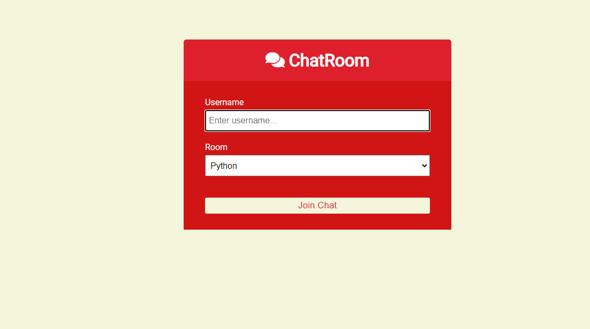
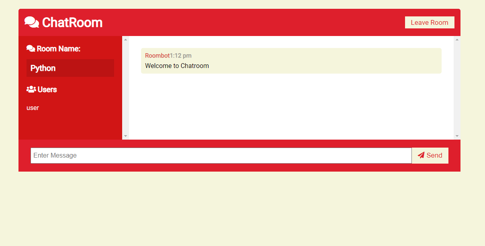

# Chat-room

This is chatroom done with tutorial of brad traversy

# Dependencies

      - Express js
      -Socket.io - javascript library for realtime communicaton 
      -moment - javascript library for time
      
      
# To run
 Clone or download the Repository 
 After that type bleow command in cmd
 
    npm install
    npm run dev
    
      
#Demo images

          
          
